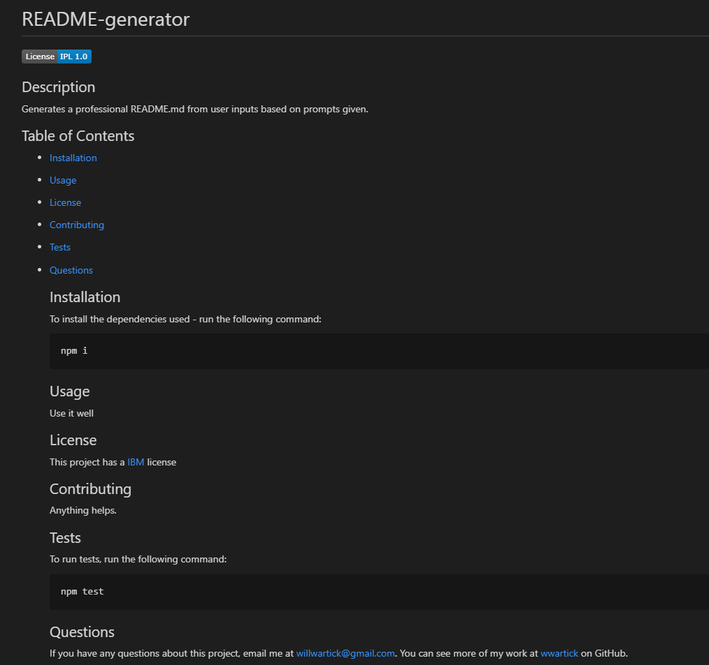

# README-generator

  

  ## Description

  Generates a professional README.md from user inputs based on prompts given. [----> View the video demo here. <-----](https://drive.google.com/file/d/1_xecRO2VKaca-lE8MaD3P-QCMrLhDXo1/view)

  ## Table of Contents

  * [Installation](#installation) 
* [Usage](#usage) 
* [License](#license) 
* [Contributing](#contributing) 
* [Tests](#tests) 
* [Questions](#questions) 


  ## Installation 

  To install the dependencies used, run the following command:
  ```
  npm i
  ```

  ## Usage

  

  ## License 
  This project has a [IBM](https://opensource.org/licenses/IPL-1.0) license (doesn't really, just said so for the demonstration video)
  
  ## Contributing

  Anything helps.

  ## Tests

  To run tests, run the following command: 
  ```
  npm test
  ```

  ## Questions

  If you have any questions about this project, email me at [willwartick@gmail.com](mailto:willwartick@gmail.com). You can see more of my work at [wwartick](https://github.com/wwartick) on GitHub.

